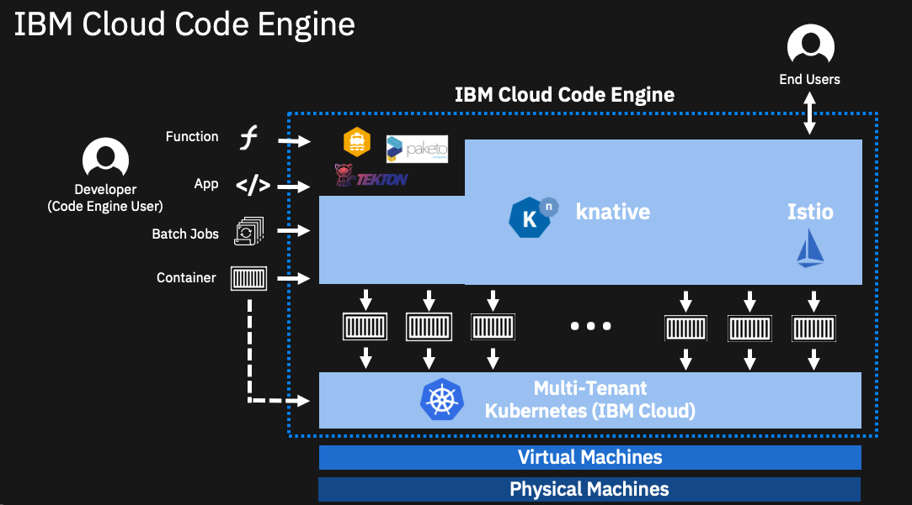

# code_engine_workshop

## 事前準備
1.IBM Cloud アカウント作成<br>
　IBM Cloud Code Engineを使用するためにはIBM Cloudの標準アカウントが必要になります。（要クレジットカードの登録）<br>
　また実際に稼働するアプリによっては課金されますのでご注意ください。<br>
2.Dockerのインストール<br>
　Windows:　http://docs.docker.jp/v1.12/windows/step_one.html<br>
　Mac:　https://hub.docker.com/editions/community/docker-ce-desktop-mac<br>
3.IBM Cloud CLIのインストール<br>
  こちらからインストールしてください。　https://cloud.ibm.com/docs/cli?topic=cli-install-ibmcloud-cli&locale=ja



## ワークショップ内容
Code-EngineにWatson Translatorを使った翻訳アプリをデプロイします。

手順
1. Watson Translation サービスの作成
2. ソースコードのクローン、上記サービスのAPI keyを設定Docker イメージを作成
3. DockerイメージをIBM CLoudにアップロード、Code Engineで稼働させる

## 1. Watson Translationサービスの作成
ibmcloud (https://cloud.ibm.com) にログインして以下のように”カタログ”、”サービス”、”AI/Machine learning",と選んででてくる”Language Translator"をクリックしてください。

無料のプランが選択されているのを確認して”作成”でサービスを作成しtください。

サービスが作成されたら認証情報、APIKeyを取得します。API鍵の右側をクリックするとAPI鍵がクリップボードにコピーされます。年のためにメモ帳か何かに入力しておくといいでしょう。


## ソースコードのクローン、上記サービスのAPI keyを設定Docker イメージを作成
ソースコードをご自分のPCにクローンしてください
```
$ git clone https://github.com/osonoi/language-translator-nodejs
$ cd language-translator-nodejs
```
手順１でメモをしたAPIキーを設定します。まずは設定ファイルの準備をします。
```
cp .env.example .env
```
.envを編集してください。LANGUAGE_TRANSLATOR_IAM_APIKEY=の後に手順１で取得したAPI Keyを入れてください。
記入例
```
$ cat .env
# see https://cloud.ibm.com/docs/watson?topic=watson-iam
LANGUAGE_TRANSLATOR_URL=https://gateway.watsonplatform.net/language-translator/api
LANGUAGE_TRANSLATOR_IAM_APIKEY=S****************************************Tjz
```
Dockerイメージを作成し、後ほどIBM Cloudのレジストリーにあげるためのタグをつけます。
```
$ docker build -t jp.icr.io/code_engine_ns/language-translator-nodejs .
(jp.icr.ioはロケーション、code_engine_nsはこの後に作成するネームスペースです）
```

```
$ ibmcloud login -r jp-tok
(ログイン用のe-mailアドレス、パスワードを入力してください）
$ ibmcloud login -g Default
（人によってはエラーが出る場合があります。その時は　-g default で試してみてください）
$ ibmcloud cr login
(コンテナーレジストリーにログイン)
$ ibmcloud cr namespace-add code_engine_ns
(ネームスペースの作成)
$ docker push jp.icr.io/code_engine_ns/language-translator-nodejs
（イメージをアップロード、プッシュ）
```


## DockerイメージをIBM CLoudにアップロード、Code Engineで稼働させる


