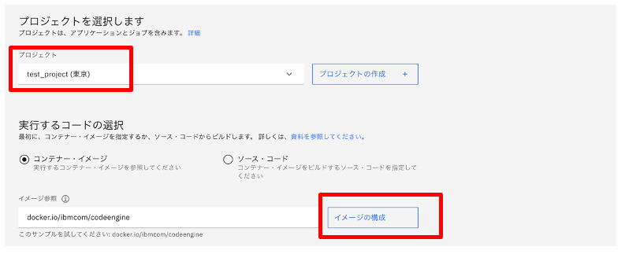

# code_engine_workshop

## 事前準備
1.IBM Cloud アカウント作成<br>
　IBM Cloud Code Engineを使用するためにはIBM Cloudの標準アカウントが必要になります。（要クレジットカードの登録）<br>
　また実際に稼働するアプリによっては課金されますのでご注意ください。<br>
 Code Engineの料金：　https://cloud.ibm.com/docs/codeengine?topic=codeengine-pricing　<br>


2.Dockerのインストール<br>
　Windows:　http://docs.docker.jp/v1.12/windows/step_one.html<br>
　Mac:　https://hub.docker.com/editions/community/docker-ce-desktop-mac  <br>
3.IBM Cloud CLIのインストール<br>
  こちらからインストールしてください。　https://cloud.ibm.com/docs/cli?topic=cli-install-ibmcloud-cli&locale=ja  <br>
4.Docker Hubのアカウント作成(IBM Cloudのコンテナーレジストリーを使用する場合は必要ありません）

こちらからDockerHubのアカウントを作成(Sign up)してください。
 https://hub.docker.com/signup


## ワークショップ内容
Code-EngineにWatson Translatorを使った翻訳アプリをデプロイします。


(Docker イメージをIBM CLoud container レジストリーではなくDocker HubにアップロードしてCode Engineでデプロイすることもできます。その場合はDockerHubのアカウントが必要になります）

## 手順
1. Watson Translation サービスの作成
2. ソースコードのクローン、上記サービスのAPI keyを設定Docker イメージを作成、DockerイメージをIBM CLoud（またはDocker Hub)にアップロード
3. アップロードしたDockerイメージでCode Engineを稼働させる

## 1. Watson Translationサービスの作成
ibmcloud (https://cloud.ibm.com) にログインして以下のように”カタログ”、”サービス”、”AI/Machine learning",と選んで出てくる”Language Translator"をクリックしてください。


無料のプランが選択されているのを確認して”作成”でサービスを作成しtください。


サービスが作成されたら認証情報、APIKeyを取得します。API鍵の右側をクリックするとAPI鍵がクリップボードにコピーされます。念のためにメモ帳か何かに入力しておくといいでしょう。


## 2. ソースコードのクローン、上記サービスのAPI keyを設定Docker イメージを作成、DockerイメージをIBM CLoud（またはDocker Hub)にアップロード

ソースコードをご自分のPCにクローンしてください
```
$ git clone https://github.com/osonoi/language-translator-nodejs
$ cd language-translator-nodejs
```
手順１でメモをしたAPIキーを設定します。まずは設定ファイルの準備をします。
```
cp .env.example .env
```
.envを編集してください。LANGUAGE_TRANSLATOR_IAM_APIKEY=の後に手順１で取得したAPI Keyを入れてください。
記入例
```
$ cat .env
# see https://cloud.ibm.com/docs/watson?topic=watson-iam
LANGUAGE_TRANSLATOR_URL=https://gateway.watsonplatform.net/language-translator/api
LANGUAGE_TRANSLATOR_IAM_APIKEY=S****************************************Tjz
```
＊IBM Cloudにイメージをアップロードする場合
Dockerイメージを作成し、後ほどIBM Cloudのレジストリーにあげるためのタグをつけます。
ここでは日本のデータセンター(jp.icr.io)にネームスペースを作成してそこにイメージをアップロードいたします。
ネームスペース名はデータセンター内で他のユーザーも含めて唯一の他と重複しないユニークなものでなければいけません。（ご自分の名前＋日付とかがおすすめです）
```
$ docker build -t jp.icr.io/(任意のネームスペース名)/language-translator-nodejs .
```
IBM CLoudにログインして作業を進めていきましょう。
```
$ ibmcloud login -r jp-tok
(ログイン用のe-mailアドレス、パスワードを入力してください）
$ ibmcloud target -g Default
（人によってはエラーが出る場合があります。その時は　-g default で試してみてください）
$ ibmcloud plugin install container-registry (必要に応じて）
$ ibmcloud cr login
(コンテナーレジストリーにログイン)
$ ibmcloud cr namespace-add (任意のネームスペース名)
(ネームスペースの作成)
$ docker push jp.icr.io/(任意のネームスペース名)/language-translator-nodejs
（イメージをアップロード、プッシュ）
```


＊Docker Hubにイメージをアップロードする場合
```
$ docker login
(Dockerにログイン)

*IBMCloudにアップするためのイメージを作成されている方は以下のコマンドでタグ名を変更してください。

$ docker tag $(docker images jp.icr.io/(任意のネームスペース名)/language-translator-nodejs -q) (Dockerのアカウント名)/language-translator-nodejs
（DockerイメージのにDockerHubにアップロードするためのタグをつける）

まだイメージを作成したいない方はこちらのコマンドで作成します。
$ docker build -t (Dockerのアカウント名)/language-translator-nodejs .

$ docker push (Dockerのアカウント名)/language-translator-nodejs
(DOckerイメージをDocker Hubにアップロードします)
```

## 3. アップロードしたDockerイメージでCode Engineを稼働させる

検索でcode engineと入力してください。Code Engineが出てきたらクリック


今回はコンテナーイメージの実行でやります。


最初にプロジェクトを作成します。


プロジェクトの詳細を入力します。名前は任意でいいです。


プロジェクトができたら次はイメージ（先程アップした）の指定です。



(IBM Cloud container registryの場合）先程アップした時の情報を選択してください。終わったら完了をクリック


(Docker Hubの場合）先程アップした時の情報を選択してください。終わったら完了をクリック


最後に環境変数を設定します。管渠変数は２つ
LANGUAGE_TRANSLATOR_URL、LANGUAGE_TRANSLATOR_IAM_APIKEY　です。
LANGUAGE_TRANSLATOR_URLにはhttps://gateway.watsonplatform.net/language-translator/api

LANGUAGE_TRANSLATOR_IAM_APIKEY　には　手陣１で取得したAPI Keyを入れます。


アプリ作成の準備ができました。右下の作成をクリック


しばらくすると作成完了です。”アプリケーションURLを開く”をクリックしてアプリを開きましょう。


こらがアプリ画面です。


いろんな翻訳を試してみてください。


お疲れ様でした！
